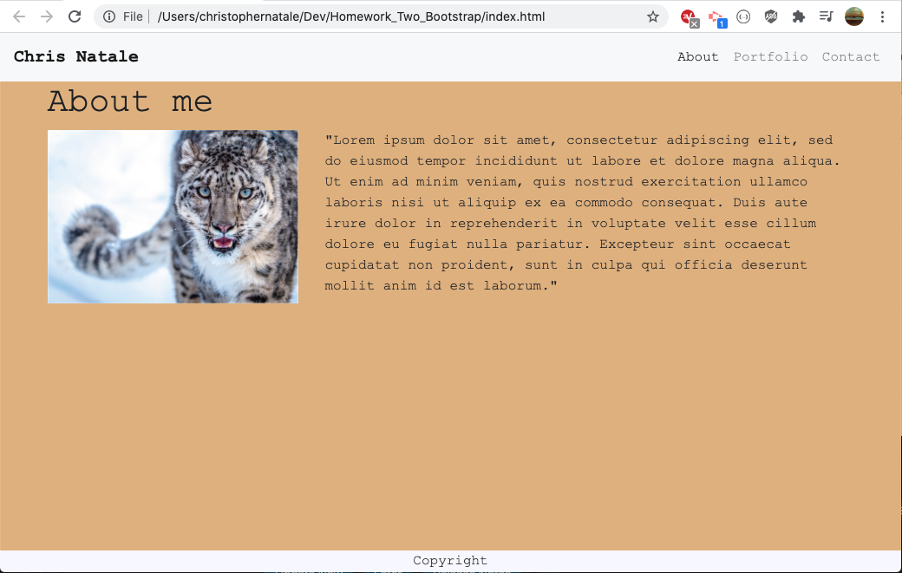

# README 
   ## Title
   ### Bootstrap Portfolio

   ## Preview
   

   ## Badges
   

   ## Description
   Developing a basic online portfolio using bootstrap as a CSS framework.

   ## Table of Contents
   * [Installation](#Installation)
   * [Usage](#Usage)
   * [License](#License)
   * [Tests](#Tests)
   * [Contribution](#Contribution)
   * [Collaborators](#Collaborators)
   * [Questions](#Questions)

   ## Installation
   No installation required. 
   
   ## Usage
   N/A

   ## License
   This project is licensed under the MIT license.

   ## Tests
   N/A

   ## Contribution
   There are many ways in which you can participate in the project, for example:

   - Submit bugs and feature requests, and help us verify as they are checked in
   - Review source code changes
   - Review the documentation and make pull requests for anything from typos to new content 

   ## Collaborators 
   Prepared with that assistance of bootstrap documentation available [here](https://getbootstrap.com/)

   ## Questions
   Email: christopher.j.natale@gmail.com.
   Github Profile: http://github.com/cnat3103